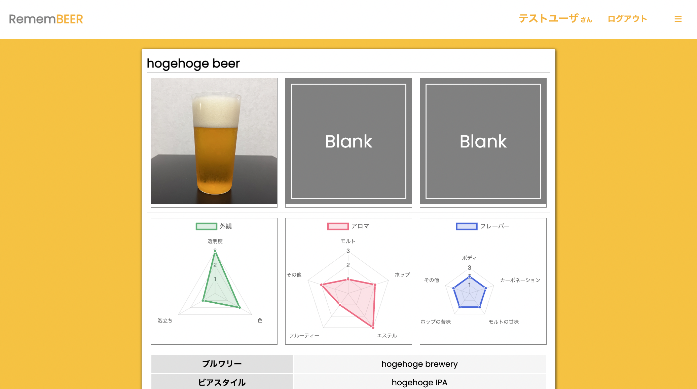

# RememBEER (試作版)

## URL

https://remembeer-beta.herokuapp.com/

```
iPhone、Androidなどのスマートフォンには対応していません。
お手数ですが、パソコンからお試しください。
```


## テスト用アカウント

| Item     | Content         |
| -------- | --------------- |
| Nickname | テストユーザ      |
| E-mail   | test@test.com   |
| Password | aaa111          |

## 概要

ビールのテイスティングノートを記録するアプリです。
記録する情報は主に以下となります。

* 写真 (3枚まで)
* テイスティングの記録 (外観、アロマ、フレーバー)
* その他情報を自由記載

## 利用方法

### 1. 以下のURLにアクセスする。

https://remembeer-beta.herokuapp.com/

### 2. 以下のような認証フォームが表示されるので、`Basic認証` のID、PWを入力する。


### 3. 以下のトップページが表示されるので、ページ右上の `ログイン` を選択する。


### 4. 以下のログインフォームが表示されるので、 `テスト用アカウント` の `E-mail` と `Password` を入力し、 `Log in` を押す。


### 5. トップページの右上にユーザ名 (テストユーザ) が表示されていると、ログインができている。


### 6. メニューから `思い出を残す` を選択する。


### 7. 各項目を入力し、 `思い出に残す` ボタンを押す。


### 8. 登録したテイスティングノートが一覧表示される。


### 9. 一覧表示からビールを選択すると詳細表示される。



### 10. 詳細表示のページ下部に編集用 `思い出を修正する` ボタンと、削除用の `忘れる` ボタンがあるので、必要に応じて使用する。


## アプリケーション作成の背景

ビールを趣味にしており、その中でもラベルを収集することを長年続けております。
しかし、ラベル収集を続けるうちに、以下の懸念点が生まれてきました。
* 場所を取る
* 情報がラベルのみのため、味をはっきり思い出せない
* ラベルが重複する

これらを解決するために、以下をコンセプトに本アプリケーションの開発に至りました。
* ラベルを電子化する
* テイスティングした際の感想を記録する
* 記録したテイスティングノートを管理する。

## 要件定義

https://docs.google.com/spreadsheets/d/1ZEAVOCXyXY613gTUO_9wlWCBVICAtAdW5C9Lqyum0DU/edit#gid=982722306

## 実装予定の機能

* 検索機能
* コメント機能
* いいね機能
* レスポンシブデザイン

## 動作確認状況

* macOS
  * Google Chrome
  * Safari
* Windows
  * Edge
* iOS
  * 未確認
* Android
  * 未確認

## データベース設計

### "users" table
| Column                | Type       | Options                        |
| --------------------- | ---------- | ------------------------------ |
| email                 | string     | null: false, unique: true      |
| encrypted_password    | string     | null: false                    |
| nickname              | string     | null: false                    |

#### Association
- has_many :notes

### "notes" table
| Column                | Type       | Options                        |
| --------------------- | ---------- | ------------------------------ |
| name                  | string     | null: false                    |
| brewery               | string     |                                |
| beer_style            | string     |                                |
| srm                   | integer    |                                |
| ibu                   | integer    |                                |
| abv                   | integer    |                                |
| looks_clear_id        | integer    |                                |
| looks_color_id        | integer    |                                |
| looks_foam_id         | integer    |                                |
| aroma_malt_id         | integer    |                                |
| aroma_hop_id          | integer    |                                |
| aroma_ester_id        | integer    |                                |
| aroma_fruit_id        | integer    |                                |
| aroma_other_id        | integer    |                                |
| flavor_body_id        | integer    |                                |
| flavor_carbonation_id | integer    |                                |
| flavor_malt_id        | integer    |                                |
| flavor_hop_id         | integer    |                                |
| flavor_other_id       | integer    |                                |
| memo                  | text       |                                |
| user                  | references | null: false, foreign_key: true |

#### Association
- belongs_to :user

## 開発環境

### フロントエンド
* HTML
* CSS
* JavaScript

### サーバサイド
* Ruby on Rails

### データベース
* MySQL

## 備考
思いつきで計画性なく実装しているため、不要なコードが多い状況です。
ある程度の機能実装が完了出来次第、正式版として改めてリリースしたいと考えております。